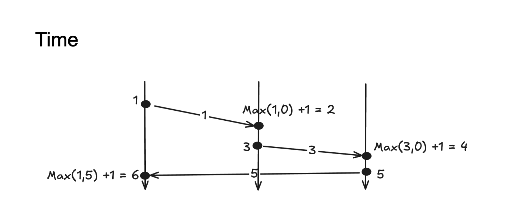

+++
title = 'Making the Right Choice: Flink or Kafka Streams?'
author = 'Juliusz Nadberezny'
date = 2024-01-14T07:07:07+01:00
draft = false
+++

## Introduction
This is a question many teams may face when starting a new project with real-time streaming requirements: Should we use Flink or Kafka Streams?
In this post, I aim to guide you and help you make an informed decision based on practical factors. This comparison may also be useful if you’re considering migrating from one engine to another.
To do this properly, we’ll examine both engines across several important dimensions.
Disclaimer: This article assumes some initial familiarity with at least one of the two technologies—either Flink or Kafka Streams. The goal here is not to cover the basics, but rather to highlight the deeper architectural differences and trade-offs that aren’t always obvious at first glance.
At its core, the responsibility of a streaming engine is to provide robust tools for handling **stateful** and **timely** operations over continuous streams of events. We’ll begin by looking at what mechanics of time each engine provides and then explore how they manage state. We’ll continue with deployment and orchestration capabilities and finally, look at their flexibility, and the ecosystems around them.
 
Then we will dive into what deployment mode they provide and how you can orchestrate them. Also, how versatile and flexible they are and what is the ecosystem around them. 

## Similarities
Let’s start by outlining the similarities between Flink and Kafka Streams—because there are quite a few. Both frameworks share common concepts and a similar way of structuring your streaming topology. In each, you define a Directed Acyclic Graph with multiple sources and multiple sinks.

Their programmatic APIs also have a lot in common. You work with high-level operations like keyBy, map, flatMap, aggregations, windowing, joins, unions, and more. Both support the ability to combine and transform streams in expressive and composable ways.

For more advanced use cases, they both offer low-level APIs—Flink provides the ProcessFunction, while Kafka Streams exposes a Processor API. Speaking of APIs, there are differences in how operator state is handled, but I’ll get into that a bit later.

They also both provide SQL layers for higher-level stream processing, which can be useful for teams looking to abstract away some of the imperative logic.

And finally, both use RocksDB as one of the state backends for scalable, local state storage.

But with this article, I want to focus on the fundamental differences - the kind that shape architecture and influence long-term maintainability and flexibility. We won’t be diving into what Werner Herzog might call the “accountant’s truth.” Instead, we’ll keep our eyes on what really matters when building reliable, scalable streaming systems.

## Time

The most fundamental concept in stream processing is the notion of time—specifically, logical time, often referred to as event time. This concept abstracts away from wall-clock time. Instead, the timestamps on the events themselves drive the progression of time. In other words, it’s the data that moves the clock forward.
You might think of this as somewhat similar to Lamport’s **logical clock**: if no new events arrive, time stands still.
Flink and Kafka Streams approach this concept differently.

### Kafka Streams and Stream Time
Kafka Streams uses a concept called stream time, which is defined as the maximum event timestamp observed so far. It’s a simple and intuitive model: time progresses only when new events with later timestamps arrive.

However, this tight coupling of time and event flow introduces limitations. If an operator filters out most events, stream time may stall, causing issues for time-based operations like windowing. Since no new timestamps are observed, Kafka Streams can’t advance stream time. This might be really problematic in scenarios where one of your operators is aggressively filtering out events, which will hold downstream operators from releasing windows because they won’t be able to notice the progress of time.

### Flink and Watermarks
Flink, on the other hand, introduces watermarks—special time markers that flow independently through the data stream. While they are still based on event timestamps, they flow through the stream independently.
This decoupling solves the problem Kafka Streams faces. Even if no events pass through a given operator, Flink can continue advancing time via watermarks. This also allows it to handle idle sources gracefully by emitting idle markers, ensuring that downstream operators don’t get stuck waiting.

## State
Working with unbounded data means you need state. In other words, you need to remember what happened before. State is a memory of past events—and that state needs to scale. Both Flink and Kafka Streams use RocksDB for managing local state when it grows beyond memory. But this state is ephemeral—it must be backed by a durable storage layer. It's very common to keep gigabytes of processing state memory distributed over worker nodes. This memory needs to be scalable.

### Kafka Streams State Backing
Kafka Streams stores state changelogs in Kafka topics. This approach of “eating your own dog food” has the benefit of avoiding additional external dependencies. However, it comes with significant architectural trade-offs.
By tightly coupling compute and storage within Kafka itself, you inherit all of Kafka’s operational complexities: broker rebalancing, partition reassignment, scaling challenges, and increased load on the Kafka cluster as your stream processing workload grows.

### Flink State Backing
Flink backs its state to remote storage, typically Amazon S3, HDFS, or another distributed file system. This separation allows for less maintenance and less costs . Moreover, the new feature of Flink’s - Disaggregated State and ForSt state backend unlocks some storage limitations of cloud native deployments.
Disaggregated State and the ForSt backend are designed to make large state workloads more cloud-friendly.
This is especially important for long-running jobs with large keyed state, such as session-based analytics or enrichment use cases. Without disaggregated state, scaling these jobs becomes painful— imagine all those scenarios where you had to reinvent your streaming architecture because you were limited by local storage for TaskManagers
Overall, maintainability improves when state management is decoupled and externalized. You gain faster recovery, and the freedom to optimize compute usage, all of which are much harder to achieve when your state is locked inside the execution layer.

## Deployment and Operations
If you’re not using a fully managed service and need to run your streaming engine yourself, deployment and operational concerns become critical.

### Kafka Streams Simplicity (and Trade-Offs)
Kafka Streams is just a library, which makes it easy to integrate into your application - it’s just a Java library that you embed into your application code. You don’t deploy a Kafka Streams “cluster” - instead, your application is the processing node. But this simplicity comes at a cost - many of the responsibilities are put on your shoulders.
This library-only model can make Kafka Streams challenging to operate at scale, especially in production environments. Take, for example, something as fundamental as exception handling. Kafka Streams provides only a basic mechanism: the StreamsUncaughtExceptionHandler, which lets you decide whether to replace the thread that encountered an exception, shut down a client, or terminate the entire application. 
But, there’s no built-in way to configure a fine-grained restart strategy with retries, backoff intervals, or fallback logic. Needless to say that you will miss a centralized fault handling. Each instance is responsible for itself. There’s no external controller that can reschedule or restart jobs. You’re essentially left to handle all of that on your own.

### Flink’s Runtime
Flink is a fully-fledged distributed data processing framework. Flink has a dedicated runtime architecture built around JobManagers and TaskManagers. JobManager: The brain of a Flink deployment is responsible for job scheduling, checkpoint coordination, failure recovery, and overall resource orchestration. Flink ecosystem offers native orchestration tools, including excellent Kubernetes support via the Flink Kubernetes Operator.
This enables advanced capabilities like autoscaling with fine-grained resource tuning, and good support for operations. 

## Final thoughts and word about versatility

As you might have noticed, Flink came out ahead in all the aspects we compared it to Kafka Streams. But I don’t want to give the wrong impression about Kafka Streams—I think it’s a great tool. There are areas where Kafka Streams, in my opinion, does things better. One notable example is the KTable abstraction, which feels more natural and intuitive compared to how state is managed in Flink. In Kafka Streams, KTable provides a clear, high-level representation of a changelog stream as a materialized view. In contrast, Flink’s state is tightly coupled to operators and scoped within the boundaries of a specific transformation. Also, what I really like about Kafka Streams is its simplicity in terms of architecture: it runs purely on Kafka, with no extra dependencies. That can be a key advantage for some teams.
However, I don’t fully agree with the often repeated argument that Kafka Streams is much simpler than Flink. Frankly, I find Kafka Streams more challenging and harder to maintain at scale in production environments, precisely because of its “library-only” nature. The operational burden ends up on your shoulders.
But overall it’s just that Flink is better for what matters in the kinds of scenarios we’ve been focusing on. 
In the end, it might just come down to versatility. Flink’s flexibility and the broader ecosystem built around it make it a formidable contender in the streaming space. This becomes especially relevant as Kafka-less architectures continue to emerge, and lakehouses like Paimon can act as transport layers in certain scenarios.

With Kafka Streams, you’re essentially tied to Kafka—and likely Kafka Connect—when working with external systems. With Flink, you can natively consume from and write to a wide range of systems, without relying on Kafka as a middleman.

So while Kafka Streams certainly has its good parts - Flink ultimately offers a broader and more powerful foundation for real-time data processing at scale. Its architecture, flexibility, and rich ecosystem enable it to support a wider variety of use cases, from traditional streaming to emerging patterns involving data lakes and Kafka-less designs.

Choosing between the two comes down to your team’s needs, your infrastructure, and the complexity of your data workflows. But if you’re building for the long term, with scalability, observability, and operational resilience in mind - Flink might just be the more future-proof bet.

